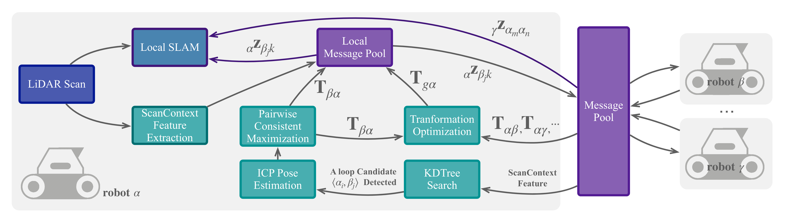

# DiSCo-SLAM

**DiSCo-SLAM is a novel framework for distributed, multi-robot SLAM intended for use with 3D LiDAR observations. The framework is the first to use the lightweight Scan Context descriptor for multi-robot SLAM, permitting a data-efficient exchange of LiDAR observations among robots. Additionally, our framework includes a two-stage global and local optimization framework for distributed multi- robot SLAM which provides stable localization results that are resilient to the unknown initial conditions that typify the search for inter-robot loop closures.**

<p align="center"></p>

## 
 - Here we provide a distributed multi-robot SLAM example for 3 robots, intended for use with the two datasets provided below.
 - The local SLAM used in our project is [LIO-SAM](https://github.com/TixiaoShan/LIO-SAM), please download [the modified version of LIO-SAM](https://github.com/yeweihuang/LIO-SAM.git), and add the DiSCo-SLAM folder into ```LIO-SAM\src```.
 ```
  ├──LIO-SAM
     ├── ...
     ├── src                    
     │   ├── ...           
     │   └── DiSCo-SLAM                # Folder for multi-robot SLAM
     └── ...
  ```
  ```
  git clone https://github.com/yeweihuang/LIO-SAM.git
  cd LIO-SAM/src
  git clone git@github.com:RobustFieldAutonomyLab/DiSCo-SLAM.git
  ```
- Code from [Scan Context](https://github.com/irapkaist/scancontext) is used for feature description.
- We use code from [PCM](https://github.com/lajoiepy/robust_distributed_mapper/tree/d609f59658956e1b7fe06c786ed7d07776ecb426/cpp/src/pairwise_consistency_maximization) 
for outlier detection.


## Dependencies
- Same dependencies as [LIO-SAM](https://github.com/TixiaoShan/LIO-SAM):
  - [ROS Melodic](http://wiki.ros.org/melodic#Installation)
  - [gtsam 4.0.2](https://github.com/borglab/gtsam/releases) (Georgia Tech Smoothing and Mapping library)
- Dependency for [Scan Context](https://github.com/irapkaist/scancontext):
  - [libnabo 1.0.7](https://github.com/ethz-asl/libnabo/releases)
  

## Datasets

- [The Park Dataset](https://drive.google.com/file/d/1-2zsRSB_9ORQ9WQdtUbGdoS4YXU3cBQt/view?usp=sharing)
- [KITTI 08 Dataset](https://drive.google.com/file/d/1U6z_1VHlPJa_DJ2i8VwxkKLjf5JxMo0f/view?usp=sharing)

To run the KITTI08 dataset, change line 9 & 10 in launch/run.launch from
  ```
<rosparam file="$(find lio_sam)/config/params.yaml" command="load" />
<rosparam file="$(find lio_sam)/src/DiSCo-SLAM/config/mapfusion.yaml" command="load"/>
  ```
to
  ```  
<rosparam file="$(find lio_sam)/config/params_k.yaml" command="load" />
<rosparam file="$(find lio_sam)/src/DiSCo-SLAM/config/mapfusion_k.yaml" command="load"/>
  ```
    
## How to use

```
cd ~/catkin_ws/src
git clone 
cd ..
catkin_make
```

```
roslaunch lio_sam run.launch
rosbag play your_bag_name.bag
```

